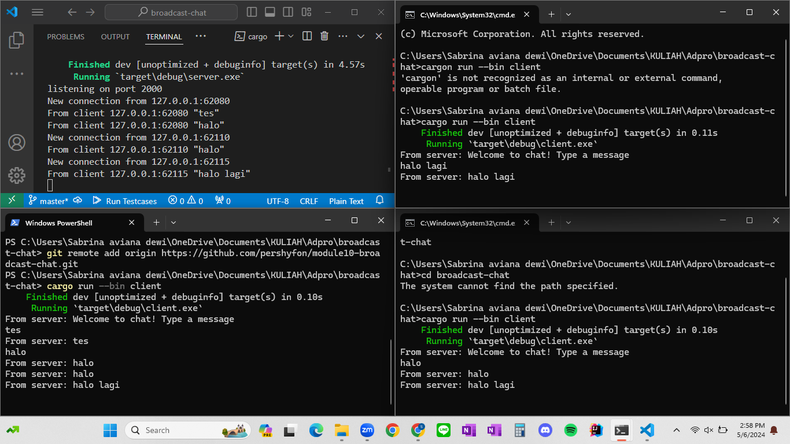

# Nama: Sabrina Aviana Dewi
# NPM: 2206030520

## Reflection
Execution Result:

Saat new executor dan spawner dibuat di `main` function, pemanggilan `println!("Sabrina's Computer: hey hey");` di main function akan dijalankan terlebih dahulu. Lalu, setelah ` executor.run();` spawner dijalankan, ia mulai mengeksekusi asynchronous task yang telah diberikan pada: mencetak pesan "Sabrina's Computer: howdy!" dan "Sabrina's Computer: done!" setelah timer 2 detik.