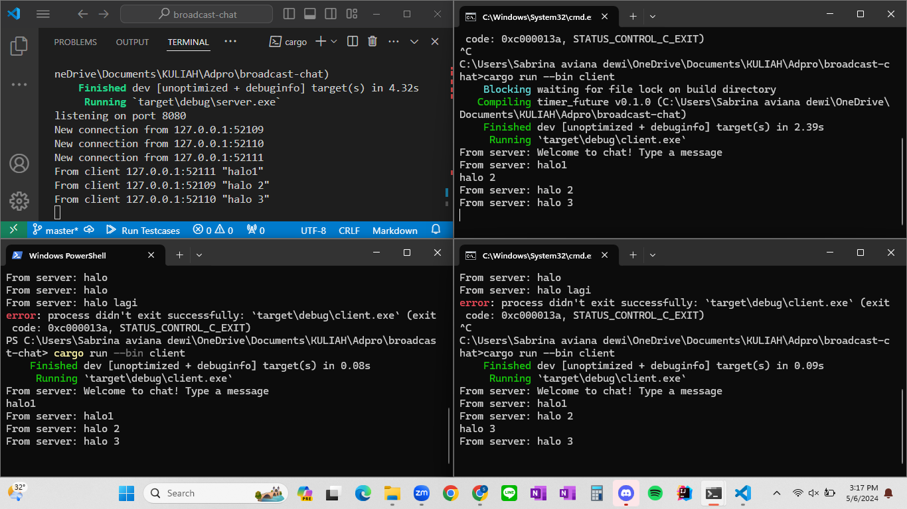

# Nama: Sabrina Aviana Dewi
# NPM: 2206030520

## Reflection
1. Understanding how it works
Execution Result:

Saat new executor dan spawner dibuat di `main` function, pemanggilan `println!("Sabrina's Computer: hey hey");` di main function akan dijalankan terlebih dahulu. Lalu, setelah ` executor.run();` spawner dijalankan, ia mulai mengeksekusi asynchronous task yang telah diberikan pada: mencetak pesan "Sabrina's Computer: howdy!" dan "Sabrina's Computer: done!" setelah timer 2 detik.

2. Multiple spawn and removing drop
Execution Result:

Program tidak berhenti karena spawner tidak di-drop dan masih menunggu task untuk dijalankan.Selain itu, urutan tugas yang tercetak tidak berurutan karena bergantung pada algoritma penjadwalan executor. Pencetakan pesan tidak selalu berurutan, meskupun eksekusi mungkin berurutan.  Setiap tugas yang dibuat oleh spawner mengonsumsi sumber daya, sehingga membuat jumlah tugas yang besar akan tidak dapat dihindari memperpanjang waktu eksekusi program.